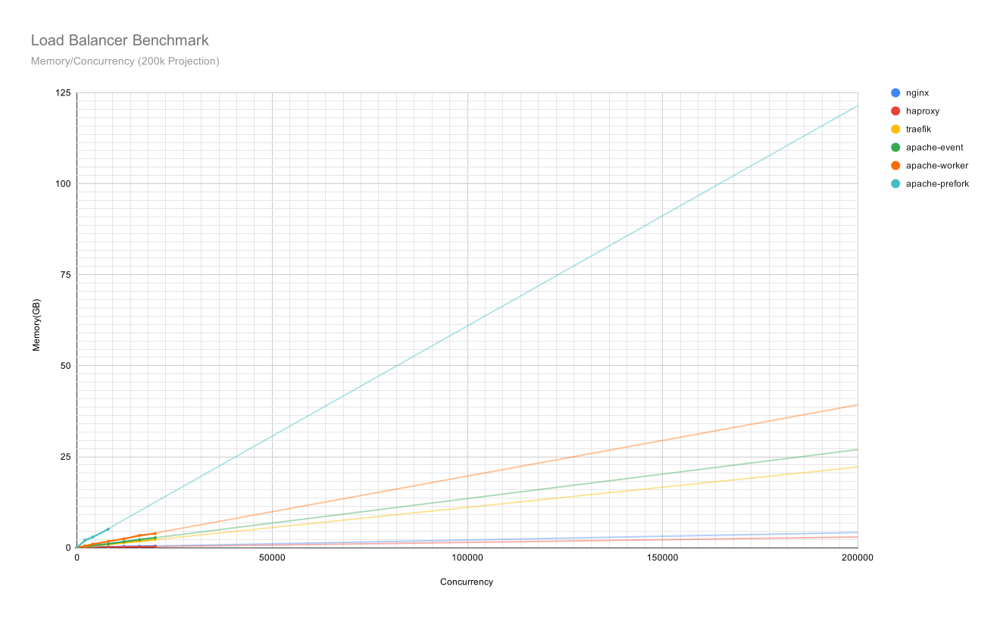
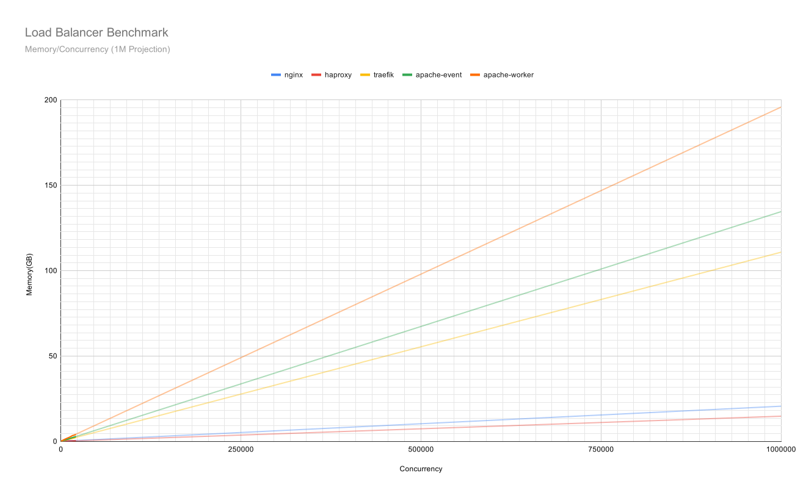

# Load Balancer Benchmark

Two decade ago, multi-core CPU start coming out, software engineers proved that 'process per request' based implementation 
was consume too much memory and not efficient to scale compared to 'thread per request'.
Then, we replaced with 'thread per request' based implementation.

The last decade, software engineers proved that 'thread per request' based implementation 
was not CPU friendly(context switching & job scheduling) and not efficient to scale too.
Then, we replaced with event-loop based implementation.

> I know it theoretically. But, I still have some questions and I can't google any answers.

* How 'bad' are bad?

* Is Apache Httpd shouldn't be recommended in all scenarios?

* All of the benchmarks I found from google search are working on <= 2000 concurrency and convince himself 'Apache is okay to use'. But, wait a minutes,
how about the performance difference when handling a spike (i.e. 20,000 concurrency)?

The only way to answer those questions is to do it by myself.

## Apahce vs Nginx vs Haproxy vs Traefik

Benchmark machine:
Load Balancer: n1-high-cpu (8 vCPU, 8GB RAM)
Backend: custom(24 vCPU, 21GB RAM) 
Benchmark Client: custom x 2 (24 vCPU)

This benchmark 

* use 16 NodeJs express as a backend that response delay with (10-300ms) to simulate real world requests with some I/O.
* use Bombardier, a GO HTTP-benchmark tools, to make 1000, 2000, 4000, 6000, 8000, 10000 concurrent requests.

## Benchmark Result






[YouTube 4k Recording](https://youtu.be/bPJO6SssbBQ)

[Google Sheet](https://docs.google.com/spreadsheets/d/1Q0Hmr1HTLyY2OFj_JbB4kUJII2LxFPhxaKL0qEgHnV0/edit?usp=sharing)

## Conclusion
Light conclusion:
Don't use thread per request for your load balancer. 
It will eat up all your memory and very likely CANNOT handle traffic spike(i.e. limited sales on specific time).

Conclusion: (TODO, will write a blog post)
## Development
```
docker-compose -f docker-compose-dev.yml up --build

# Test Traefik Config
curl http://localhost:8080/io

# Test Haproxy Config
curl http://localhost:8081/io

# Test Nginx Config
curl http://localhost:8082/io

# Test Apache Config
curl http://localhost:8083/io

# Try the benchmark
docker run -ti --rm --ulimit nofile=65535:65535 --network=host alpine/bombardier --http1 -c 10 -d 10s -t 30s -l http://localhost:8080/io
```

## Benchmark on Production
Replace `backend.c.tiny-projectsss.internal` with your backend DNS in all benchmark configs

### Load balancer
```
# Nginx
sudo docker-compose -f docker-compose-nginx.yml up

# Apache Prefork
sudo docker-compose -f docker-compose-apache-prefork.yml up

# Apache worker
sudo docker-compose -f docker-compose-apache-worker.yml up

# Apache Event
sudo docker-compose -f docker-compose-apache-event.yml up

# Traefik
sudo docker-compose -f docker-compose-traefik.yml up

# Haproxy
sudo docker-compose -f docker-compose-haproxy.yml up

```

### Backend
```
sudo docker-compose -f docker-compose-node-backend.yml up --build
```

### Benchmark client
```
./bench http://lb.c.tiny-projectsss.internal:8080/io ./benchmark-result/n1-highcpu-8-nginx 30s 4000
```
